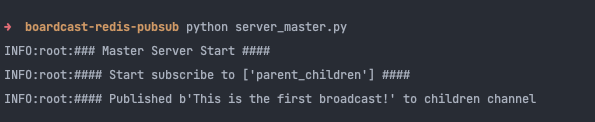

## Broadcasting Tutorial with Parent-Children servers

The tutorial is going to walk through you into how to build parent and children broadcasting (one to many)
with `Redis Pub/Sub`


### Prerequisites
* Redis 7.0 +
* Python 3.6 +

Install redis (MAC)
```shell
brew install redis
pip install -r requirements.txt
```
Start redis server

```shell
redis-server
```

Open a new tab in the terminal and run master server

```shell
python server_master.py
```

Open another tab in the terminal and run server a

```shell
python server_a.py
```

After that, start the server b

```shell
python server_b.py
```

Lastly, a new tab for redis-cli
```shell
redis-cli
```

Look into the results as following

* Master server


* Server A 


* Server B


* Redis CLI


### Author
thadchai.dev@gmail.com